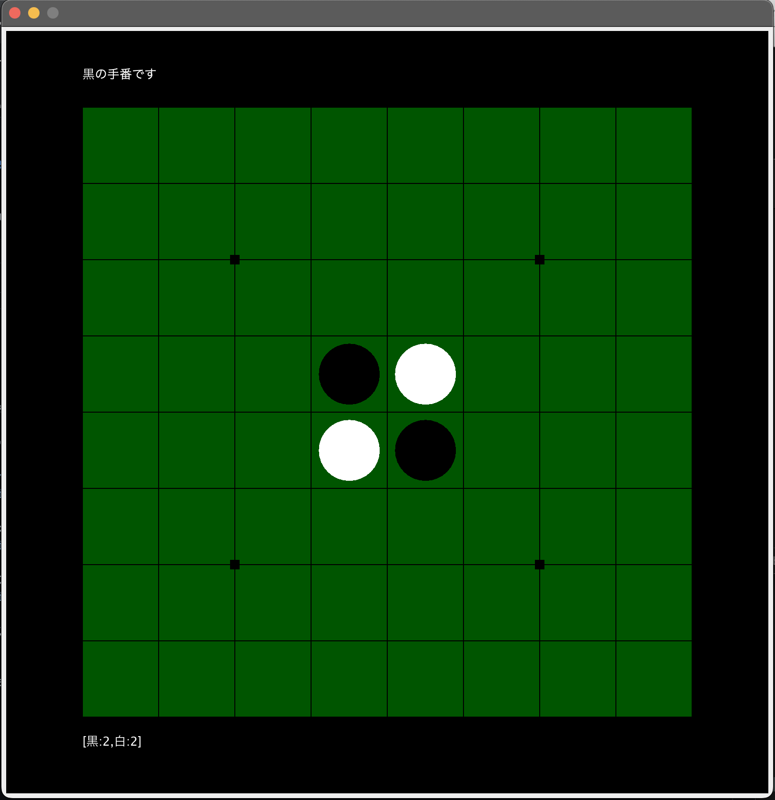
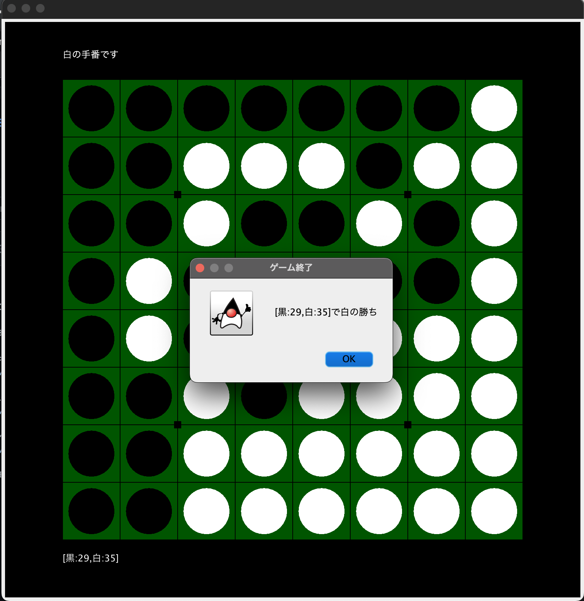

# Reversi

Javaで作成したオセロです．

対戦用とcpu戦の２種類あります．

-実行方法-
```
javac Reversi.java\
java Reversi
```
---
### 実行画面
<p align="center">
  
  <br>
  <em>ゲーム開始時画面</em>
</p>
<p align="center">
  
  <br>
  <em>ゲーム終了画面</em>
</p>
